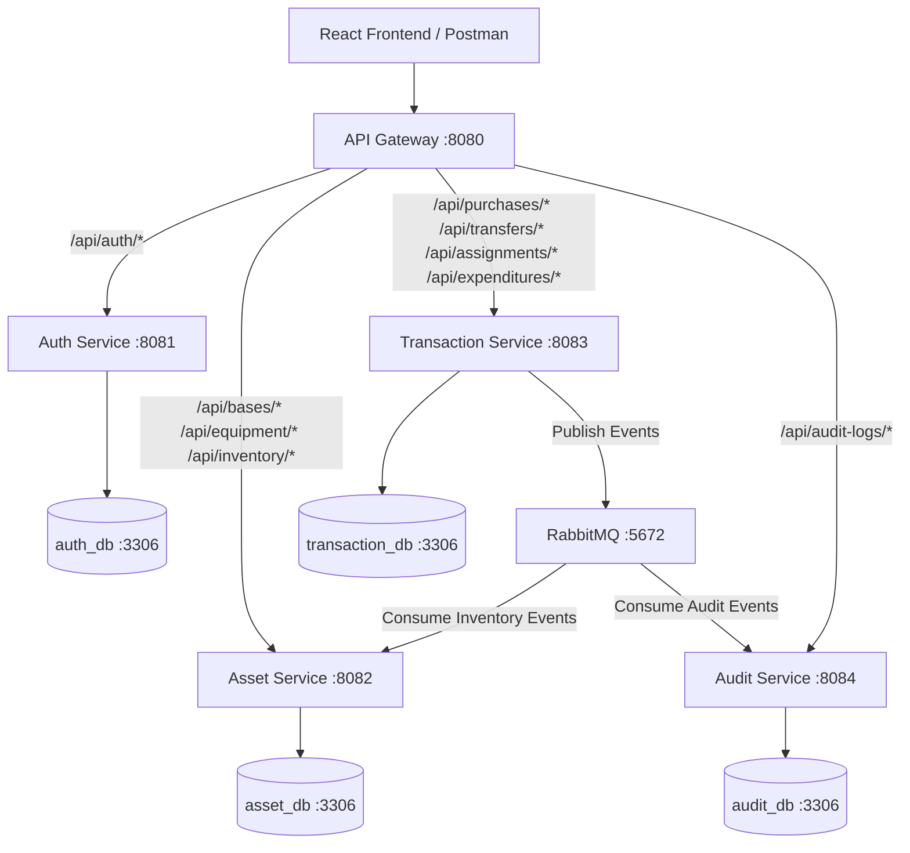

# Day 1 Architecture & Design Document

## 1. Problem Statement & System Goal
The Distributed Military Asset Management System provides a secure, audited, distributed platform for managing military bases, equipment inventory, purchases, inter-base transfers, personnel assignments, and equipment expenditures.

## 2. System Architecture Diagram



## 3. Microservice Roles & Responsibilities

| Service | Port | Database | Primary Responsibilities |
|---|---|---|---|
| **API Gateway** | 8080 | None | Route routing, CORS management, single entry-point for clients |
| **Auth Service** | 8081 | `auth_db` | User management, BCrypt password hashing, JWT generation & RBAC roles |
| **Asset Service** | 8082 | `asset_db` | Base management, Equipment catalog, Base inventory stock tracking & updates |
| **Transaction Service** | 8083 | `transaction_db` | Purchases, Transfers between bases, Personnel assignments, Expenditures & Event publishing |
| **Audit Service** | 8084 | `audit_db` | Async event listener, System-wide audit log query & filtering |

## 4. Role-Based Access Control (RBAC) & Scope Matrix

| Role | Permissions | Base Scope Restriction |
|---|---|---|
| `ADMIN` | Full access to all endpoints across all bases | None (Global Access) |
| `BASE_COMMANDER` | View inventory, manage assignments, manage expenditures, view transactions for assigned base | Restricted to assigned `baseId` |
| `LOGISTICS_OFFICER` | View inventory, create purchases, create transfers, view purchases/transfers | Global view/create for logistics |

## 5. Event-Driven Messaging Architecture (RabbitMQ)

- **Exchange**: `military.events` (Topic Exchange)
- **Queues**:
  - `asset.inventory.queue` (Routing keys: `purchase.created`, `transfer.created`, `assignment.created`, `expenditure.created`)
  - `audit.queue` (Routing key: `#`)

### Event Schemas
```json
{
  "eventType": "PURCHASE_CREATED",
  "eventId": "123e4567-e89b-12d3-a456-426614174000",
  "entityId": 10,
  "baseId": 1,
  "equipmentId": 5,
  "quantity": 20,
  "createdBy": 2,
  "timestamp": "2026-09-26T12:00:00Z"
}
```

## 6. Development Credentials & Seeding

- **Admin User**: `admin@military.com` / `Admin@123` (Role: `ADMIN`)
- **Commander Alpha**: `commander.alpha@military.com` / `Commander@123` (Role: `BASE_COMMANDER`, Base ID: 1)
- **Logistics Officer**: `logistics@military.com` / `Logistics@123` (Role: `LOGISTICS_OFFICER`, Base ID: 1)

## 7. Setup & Run Instructions
See root `README.md` for complete build, run, and verification steps.
